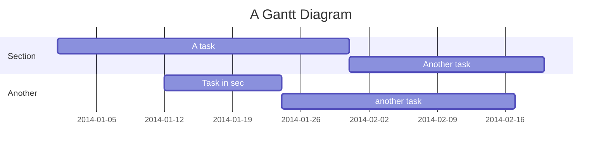
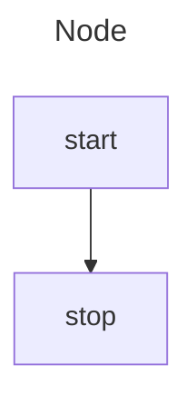
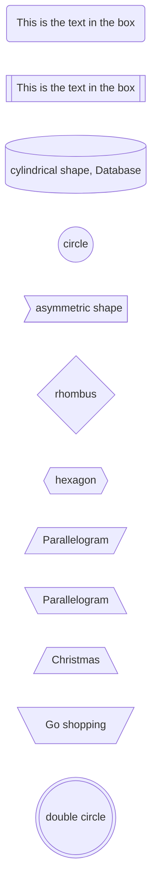
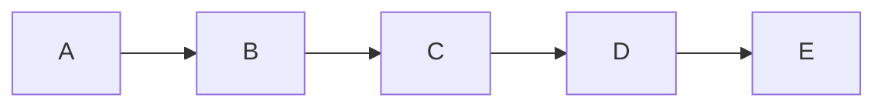
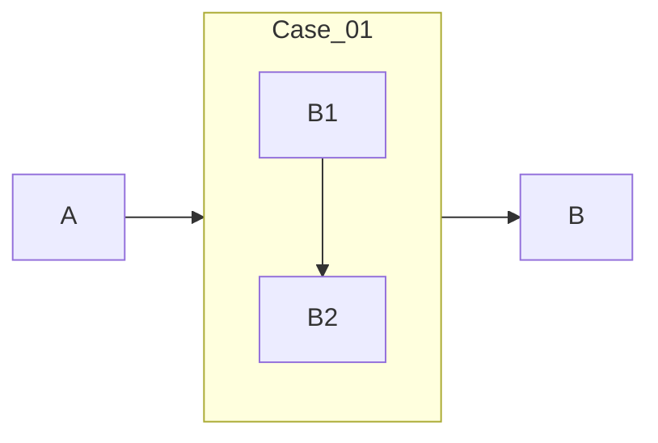
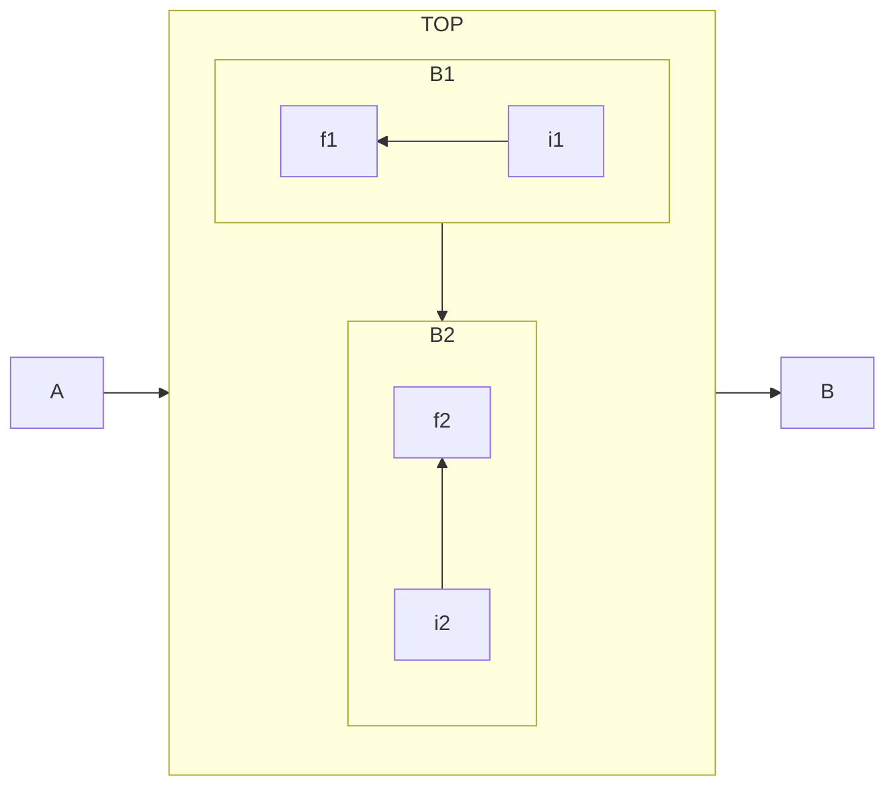
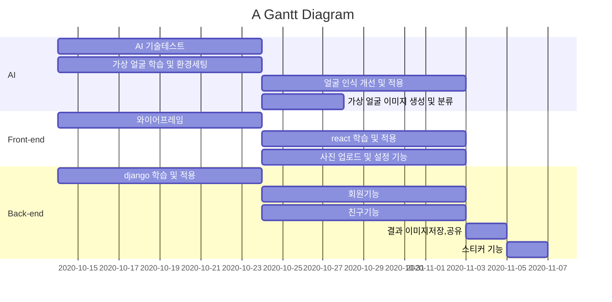

# Markdown 문법
[ref](https://eungbean.github.io/2018/06/11/How-to-use-markdown/)  


---

# Index

[1. 킨띄우기](#1-칸-띄우기)  
[2. 형광색 처리](#2-형광색-처리)  
[3. 코딩 블록 입히기](#3-코딩-블록-입히기)  
[4. 간트차트](#-Gantt)  
[5. Diagram 구문](#Diagram-구문)  
  
--- 



### [Diagram 구문](https://mermaid.js.org/syntax/flowchart.html)  
##### 1. node and direction  
  - TD or TB : Top to bottom
  - BT : Buttom to top
  - LR : Left to right
  - RL : Right to Left



##### 2. Node shapes


##### 3. 


##### 4. 
###### 4.1.

###### 4.2.



### 📖 Gantt :fire:




### 1 칸 띄우기

  


### 2 형광색 처리
<span style='background-color: #fff5b1'>Yellow</span>  
<span style='background-color: #f6f8fa'>Gray</span>  
<span style='background-color: #f1f8ff'>Blue</span>  
<span style='background-color: #ffdce0'>Red</span>  
<span style='background-color: #dcffe4'>Green</span>  
<span style='background-color: #f0f0ff'>Pupple</span>  
<span style='background-color: #f7d0be'>Orange</span>  


### 3 코딩 블록 입히기

    ㅁ In: buf  
    ㅁ Format:  


### 4 목차, 주석, 각주  
#### 목차  
: \{:toc}  
#### 주석  
: \\<!-- & -->  
#### 각주 
각주[^14]  
  

### 수식
#### latex 적용
a. latex.codecogs.com 홈페이지 접속
b. 변환하고자 하는 수식 입력
c. 출력된 이미지를 우측 마우스 클릭 후 이미지 주소 복사
d. 복사된 이미지 url을 마크다운으로 임베딩


예)


#### Tex 적용


[Ref.](https://www.math.brown.edu/johsilve/ReferenceCards/TeXRefCard.v1.5.pdf)


### 1 문단 (Paragraph)  

### 2 제목 (Header)  
  - 간편 설정 : === & ---  
  - 헤더 설정 : #  

### 3 블록 인용구  
  - '>' (블럭인용문자, Block quote)  
  - '>>', '>>>' 사용하면 여러 층 사용  

### 4 코드 (Code)  
코드 블럭 (Code Block) : ''' 혹은 \~\~~ 으로 감싼 텍스트  
혹은 줄의 맨 앞에 스페이스 4개가 삽입되었을 때.  
인라인 코드 (Inline Code) : \`로 감싼 텍스트  

- 코드블럭 예) Tab 삽입(스페이스 4개 삽입의 경우 되다 안되다 한다...)

```  
코드 예)
  code example 
```

- 코드블럭 예) 코드("```") 이용
```
public class BootSpringBootApplication {
  public static void main(String[] args) {
    System.out.println("Hello, Honeymon");
  }
}
```


### 5 강조 (Emphasis) : \* or \_

### 7 목록 (List)
7.1 번호 목록 (Ordered List)
- 숫자와 점을 이용하여 목록 생성

7.2 기호 목록 (Unordered List)
-,+,\*을 사용해 기호 목록 생성, 계층별로 나누고 싶으면 tab을 삽입

### 8 링크 (Link)  
8.1 외부 링크 (External Link)  
인라인 링크 : [링크](http://example.com"링크 제목")  
[연습](http://www.naver.com)  

참조 링크 : [링크1][1] & [1]: http://example1.com/ "링크제목1"  
URL 링크 : <example.com/> & <example@example.com>  
8.2 내부 링크 (Internal Link)  

### 9 표 (Table)  
9.2 표의 정렬 (Alignment)  
정렬하기 위해서는 : 를 헤더의 양쪽 혹은 한쪽에 삽입  
9.3 열 병합 (Column spanning)  
| Column 1 | Column 2 | Column 3 | Column 4 |  
| -------- | :------: | -------- | -------- |  
| No span  | Span across three columns    |||  


<table>
   <tbody>
      <tr>
         <td><b>followerId</b></td>
         <td><b>followingId</b></td>
      </tr>
      <tr>
         <td>text_1</td>
         <td>description of text_1</td>
      </tr>
      <tr>
         <td>text_2</td>
         <td>description of text_2</td>
      </tr>
      <tr>
         <td>text_3</td>
         <td>description of text_3</td>
      </tr>     
   </tbody>
</table>

### 10 이미지 (Image) 
: ``  

### 11 이스케이프(Backslash Escape) 
: \\  
마크다운 작성 중 \*이나 \_ 을 사용하고 싶은 경우, 해당 기호 앞에 \\를 삽입  

### 14. 각주 
: [\^myfootnote]  


[^14]: 1234567890
