# [993b 메뉴얼](https://blog.naver.com/ricky24/222526382678)

# Markdown 문법
[ref](https://eungbean.github.io/2018/06/11/How-to-use-markdown/)  


---

# Index

[A. Diagram](#Diagram)
  - [A-1. 간트차트](#4-Gantt-Chart)  
  - [A-2. Diagram 구문](#5-Diagram-구문)  
  - [A-3. User Journey](#6-User-Journey)
  - [A-4. Graph](#4-Graph)
  - [A-5. Sequence Diagram](#-Sequence-Diagram) 
  - [A-6. class Diagram](#-class-diagram)
  - [A-7. state Diagram](#-state-diagram)
  - [A-8. ER Diagram](#-er-diagram)

[B. Text](#Text)
  - [B-1. 킨띄우기](#1-칸-띄우기)
  - [B-2. 형광색 처리](#2-형광색-처리)
  - [B-3. 코드](#3-코드)
  - [B-4. 수식](#수식)
  - [B-5. 각주](#각주)

---

# Diagram
### 6. [User Journey](https://mermaid.js.org/syntax/userJourney.html)  
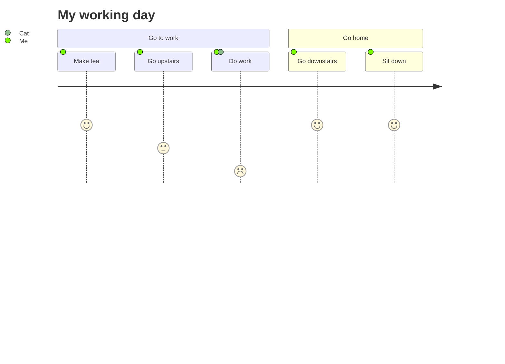
  
    journey  
        title My working day  
        section Go to work  
          Make tea: 5: Me  
          Go upstairs: 3: Me  
          Do work: 1: Me, Cat  
        section Go home  
          Go downstairs: 5: Me  
          Sit down: 5: Me  


### 5. [Diagram 구문](https://mermaid.js.org/syntax/flowchart.html)  

##### 2. Node shapes
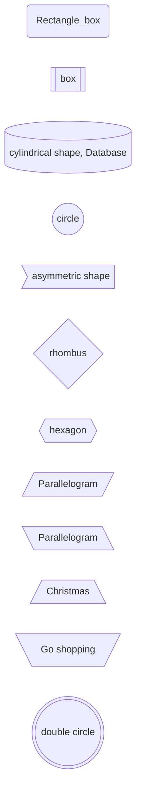

    flowchart LR
      id1(Rectangle_box)
      id2[[box]]
      id3[(cylindrical shape, Database)]
      id4((circle))
      id5>asymmetric shape]
      id6{rhombus}  
      id7{{hexagon}}
      id8[/Parallelogram/]
      id9[\Parallelogram\]
      A[/Christmas\]
      B[\Go shopping/]
      C(((double circle)))
  
### 3. Flowchart
###### 3.1.
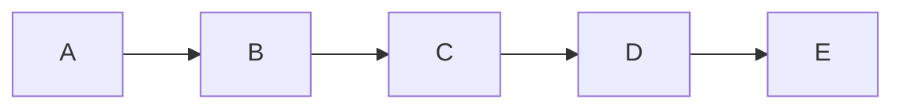

    flowchart LR
      A-->B
      B-->C
      C-->D
      D-->E
      click A "https://www.github.com" _blank
      click B "https://www.github.com" "Open this in a new tab" _blank
      click C href "https://www.github.com" _blank
      click D href "https://www.github.com" "Open this in a new tab" _blank


###### 3.2.
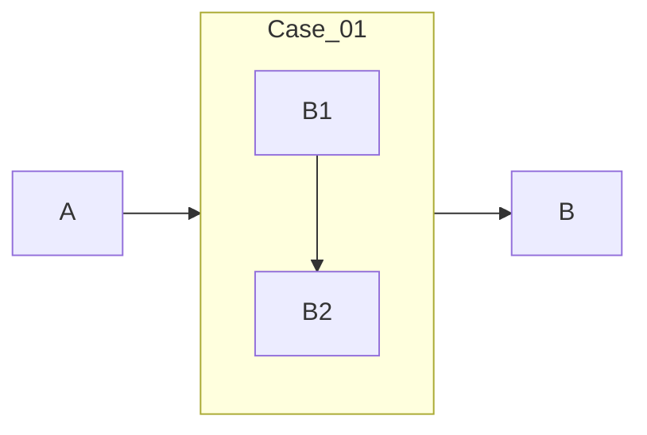

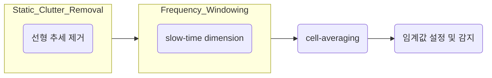

 
    flowchart LR;
      subgraph Case_01
        B1 --> B2
      end
      A --> Case_01 --> B
      

    
###### 3.3.
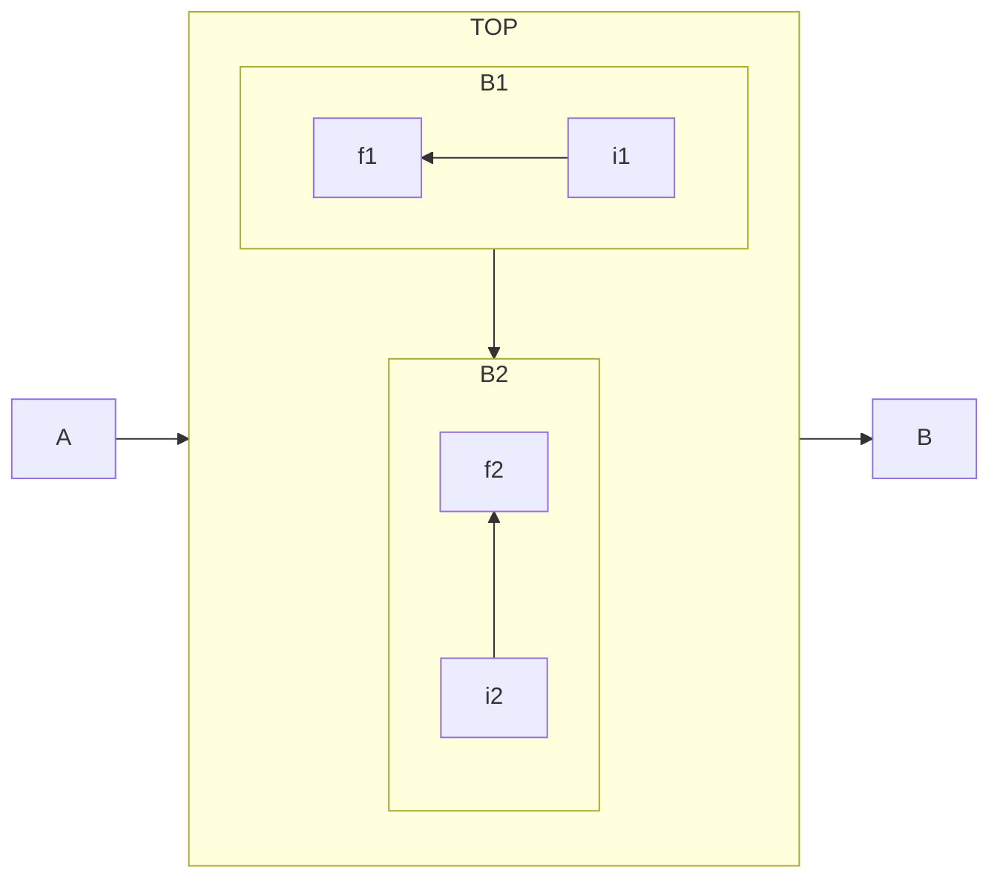

    flowchart LR
      subgraph TOP
        direction TB
        subgraph B1
            direction RL
            i1 -->f1
        end
        subgraph B2
            direction BT
            i2 -->f2
        end
      end
      A --> TOP --> B
      B1 --> B2


### 4. [Graph](https://richwind.co.kr/147)
###### case_1  
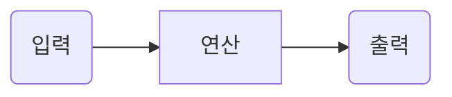

    ```mermaid
    graph LR
      A(입력)
      A-->B[연산]
      B-->C(출력)
    ```

###### Case_2
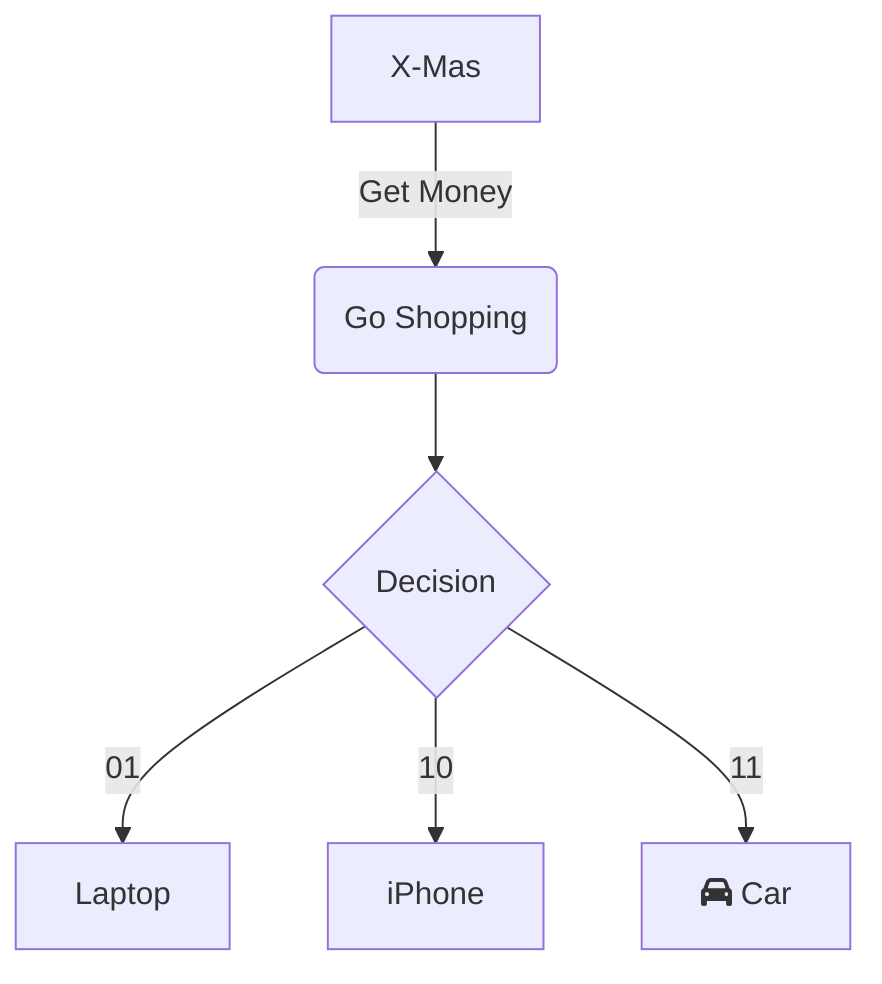

    graph
      A[X-Mas] -->|Get Money| B(Go Shopping)
      B --> C{Decision}
      C -->|01| D[Laptop]
      C -->|10| E[iPhone]
      C -->|11| F[fa:fa-car Car]

### 5. Sequence Diagram  
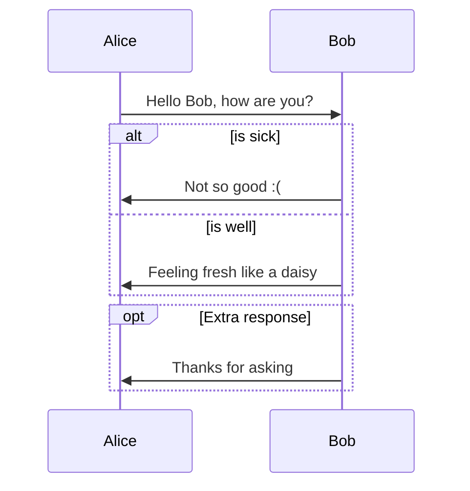

    sequenceDiagram
      Alice->>Bob: Hello Bob, how are you?
      alt is sick
      Bob->>Alice: Not so good :(
      else is well
      Bob->>Alice: Feeling fresh like a daisy
      end
      opt Extra response
      Bob->>Alice: Thanks for asking
      end

### 6. [class Diagram](https://mermaid.live/edit#pako:eNptkslOwzAQhl8l8glEF5pAl4gLoq3EoafeUCQ0sSeJVS_FC1UpfXec0IYu-OKZb_yPxzPeEaoZkpRQAdZOOZQGZKaisJ4VlyCip-9uN5p6urqmc26ra_qGuYEznEZ3XLkISrzES2e4KqMSFUNzGqwldgEymDe3FwEJDo-wKbspb_cLojZpjrB60UKbNmA3XB6Fwf3wQFdHf3-ar35Ym69b1275F76qOaJrMQU1A_evvmnBX0G51iLi9n3DBWuh8arVkg6RaCRwFibR6DLiKpSYkTSYDAvwwmUkU_VR8E4vt4qS1BmPHeLXLHTkMLtzOGPcaUPSAoQNUGgIfSbpjrjtup56ya0LGalWBS9r7o0IuHJubdN-vw73Su4qn_eoln3LWQXGVZ-TYX8YD8cQJzgcJfCYJIzmg8m4iB8GBRvdD2Ig-32HYHP_4vDF6m3_A4gUwp0)
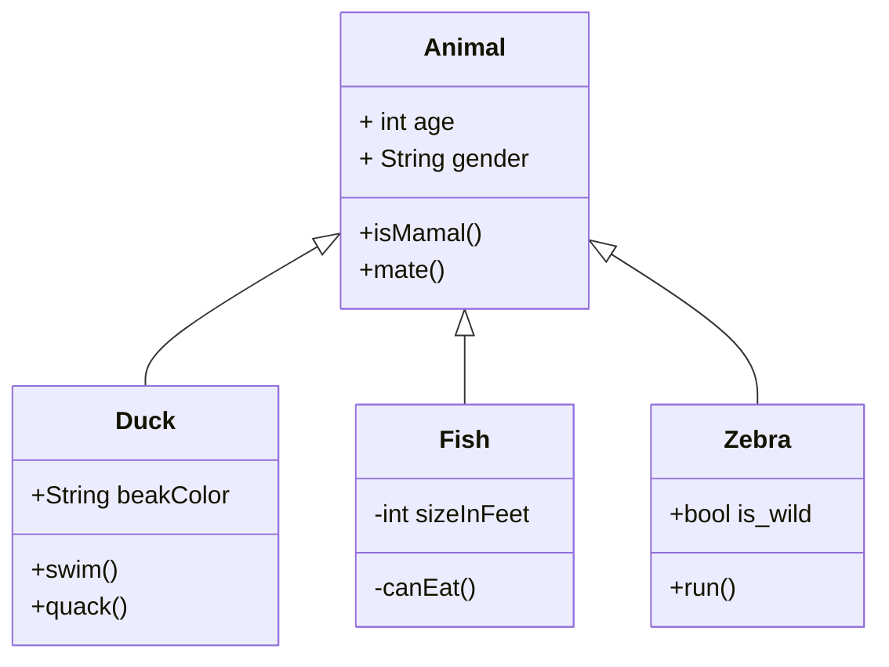

    classDiagram
      Animal <|-- Duck
      Animal <|-- Fish
      Animal <|-- Zebra
      Animal : + int age
      Animal : + String gender
      Animal : +isMamal()
      Animal : +mate()
      class Duck{
        +String beakColor
        +swim()
        +quack()
      }
      class Fish{
        -int sizeInFeet
        -canEat()
      }
      class Zebra{
        +bool is_wild
        +run()
      }


### 7. [state Diagram](https://mermaid.live/edit#pako:eNpdkDFvgzAQhf8KurGCEKAlCUOXJmOmjKXDBRtsyWBkn5EixH-vMaraxtPzd-d35zdDoxmHCiwh8bPEzmCfTHk9RP58vnxFSfIe3UgqtaEgA_TFZ3TVkxy6jW76-fkf-mHQio0G-WMKMfTc9CiZX2teG2ogwXteQ-Ul4y06RTXUw-Jb0ZG-PYYGKjKOx-BG9vuR__DCJGkDVYvKeqg0Mu6vM9BjXCPopCXv2Oihld3KnVEeC6LRVmm6lnedJOHuu0b3qZVMoCExncq0zMsj5gUvDwW-FQVr7tnp2OavWcsO-yxHWJYYeJh_3fIOsS_fJRN5Uw)
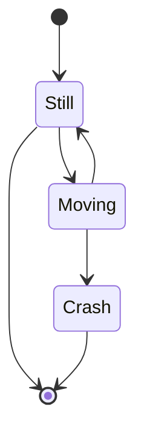
    stateDiagram-v2
      [*] --> Still
      Still --> [*]
      Still --> Moving
      Moving --> Still
      Moving --> Crash
      Crash --> [*]

### 8. [ER Diagram](https://mermaid.live/edit#pako:eNp1klFvgjAUhf8Kuc8iEzdU3gyQxWSOBdDEhJdKL9AEqCnFxAD_fUUlmy7rW0-_nnNz720h4RTBBhQuI5kgZVxp6ji7MPK3XqD13XTatZrrfWz2XnDQ164beGGo2VpO6ie263Sdt5ofuOpia6eCJPgPs_nc-xvHU1QMBSPHArWUixhu9J-0J2eBCbLz6D16DVD3AyX8jOKO3LTfgL6JvK2iWJUUDR2tvgLf3TmR7qwj790PDuOXu351rSRh1SP_UN_oHAMXFAVSlREDTKBEURJGVbPb4XcMMscSYxhQiilpCjk0oFcoaSQPL1UCthQNTqA5USLxPqFH0aNMcgF2SopaiQUnKhTsFuTlNAw2Y7VUjqrulGWD3ohCybmUp9o2jOF5mjGZN8dpwkujZjQnQubnlWVYprUk5hytxZy8zec0Oc5Wy9R8naV08TIzCfT9BPCav71t0XWZ-m_B4LnJ)
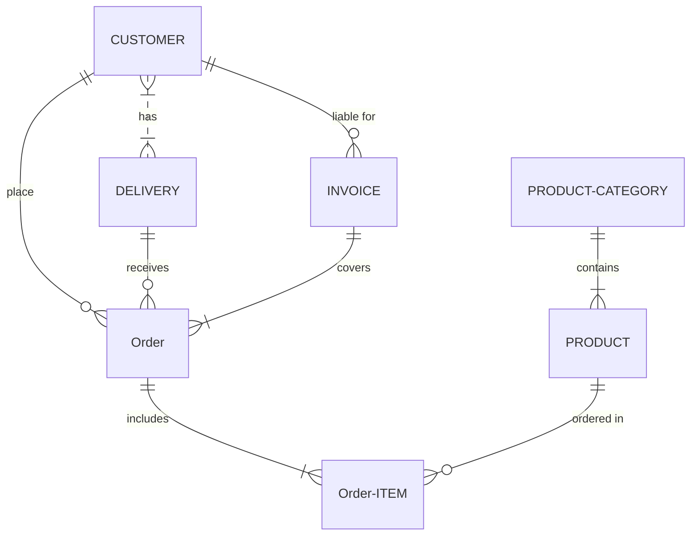

    erDiagram
      CUSTOMER }|..|{ DELIVERY : has
      CUSTOMER ||--o{ Order : place
      CUSTOMER ||--o{ INVOICE : "liable for"
      DELIVERY ||--o{ Order : receives
      INVOICE ||--|{ Order : covers
      Order ||--|{ Order-ITEM : includes
      PRODUCT-CATEGORY ||--|{ PRODUCT : contains
      PRODUCT ||--o{ Order-ITEM : "ordered in"


### 4. Gantt Chart  
  
##### 📖 Gantt :fire:

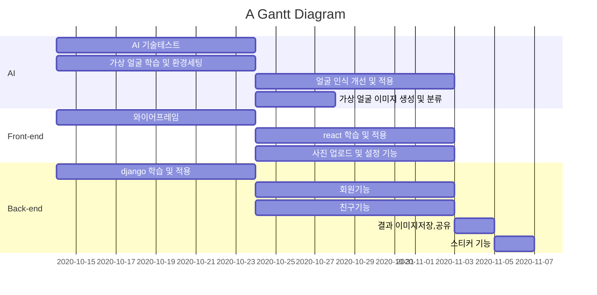
    gantt  
        title A Gantt Diagram  
        dateFormat  YY-MM-DD  
        section AI  
        AI 기술테스트  : a1, 20-10-14, 10d  
        가상 얼굴 학습 및 환경세팅  : 20-10-14, 10d  
        얼굴 인식 개선 및 적용 : after a1, 10d  
        가상 얼굴 이미지 생성 및 분류 : after a1, 4d  
    
        section Front-end
        와이어프레임     :a1,20-10-14  , 10d
        react 학습 및 적용 : after a1,  10d
        사진 업로드 및 설정 기능 :after a1 , 10d
    
        section Back-end
        django 학습 및 적용 : a1,20-10-14 , 10d
        회원기능      :a2,after a1 , 10d
        친구기능      :after a1  ,10d
        결과 이미지저장,공유  : a3,after a2, 2d
        스티커 기능  : a4,after a3, 2d


# Text
### 1-1 4칸 띄우기

``` &emsp; ```  


### 2 형광색 처리

<span style='background-color: #fff5b1'>Yellow</span>  
<span style='background-color: #f6f8fa'>Gray</span>  
<span style='background-color: #f1f8ff'>Blue</span>  
<span style='background-color: #ffdce0'>Red</span>  
<span style='background-color: #dcffe4'>Green</span>  
<span style='background-color: #f0f0ff'>Pupple</span>  
<span style='background-color: #f7d0be'>Orange</span>  


### 3 코드

코드 블럭 (Code Block) : ''' 혹은 \~\~~ 으로 감싼 텍스트  
혹은 줄의 맨 앞에 스페이스 4개가 삽입되었을 때.  
인라인 코드 (Inline Code) : \`로 감싼 텍스트  

- general  
```  
코드 예)
  code example 
```

- 코드("```") 이용  
```
public class BootSpringBootApplication {
  public static void main(String[] args) {
    System.out.println("Hello, Honeymon");
  }
}
```

    ㅁ In: buf  
    ㅁ Format:  


### 4 수식
#### 4.1 latex 적용
a. latex.codecogs.com 홈페이지 접속
b. 변환하고자 하는 수식 입력
c. 출력된 이미지를 우측 마우스 클릭 후 이미지 주소 복사
d. 복사된 이미지 url을 마크다운으로 임베딩


예)


#### 4.2 Tex 적용


[Ref.](https://www.math.brown.edu/johsilve/ReferenceCards/TeXRefCard.v1.5.pdf)


#### 4.3 [LaTex문법](https://khw11044.github.io/blog/blog-etc/2020-12-21-markdown-tutorial2/)
- 사칙연산  
  + $1 + 1 = 2$ : ``` $$1 + 1 = 2$$ ```
  + $2 - 1 = 1$ : ``` $$2 - 1 = 1$$ ```
  + $2 \times 2 = 4$ : ``` $$2 \times 2 = 4$$ ```
  + $4 \div 2 = 2$ : ``` $$4 \div 2 = 2$$ ```
  + $\frac{1}{2}$ : ``` $$\frac{1}{2}$$ ```
  + $^1/_2$ : ``` $$^1/_2$$ ```
    
- 수학 공식
  + $X_{1,j} \mathbf{F}X_{2,j}  = 0, \tag{1}$ : ``` $$X_{1,j} \mathbf{F}X_{2,j}  = 0, \tag{1}$$ ```
    
- 첨자
  + $2^2=4$ : ``` $$2^2=4$$ ```
  + $a_1, a_2, a_3$ : ``` $$a_1, a_2, a_3$$ ```
     
- 특수문자
  + $\sqrt{2}$ : ``` $$\sqrt{2}$$ ```
  + $n!$ : ``` $$n!$$ ```
    ```
    -. $n! = 1 \times 2 \times 3 \times \ldots n$  
    -. $n! = \prod_{k=1}^n k$ ```
  + $\pi$ : ``` $$\pi$$ ``` 
    ```
    -. $\pi$ ~$$\pi$$  
    -. $\Pi$ ~$$\Pi$$  
    -. $\phi$ ~$$\phi$$ ```
  + 각도 : ``` $$90^\circ$$ ```
  + limit : $\lim_{x \to \infty} \exp(-x) = 0$ ``` $$\lim_{x \to \infty} \exp(-x) = 0$$ ```  
  + 시그마 : $\sum_{i=1}^{10} t_i$ ``` $$\displaystyle\sum_{i=1}^{10} t_i$$ ```
  + log : $\log_b a$ ``` $$\log_b a$$ ```
  + 미분 : $\dv{Q}{t} = \dv{s}{t}$ ``` $$\dv{Q}{t} = \dv{s}{t}$$ ``` 
  + 적분 : $\int_0^\infty \mathrm{e}^{-x}\,\mathrm{d}x$
        ``` $$\int_0^\infty \mathrm{e}^{-x}\,\mathrm{d}x$$
        $$\int\limits_a^b$$ ```
    
- 괄호 (Parentheses)  
  + 소괄호  $(1 + 2)$ : ``` $$(1 + 2)$$ ```  
  + 중괄호  $\lbrace1 + 2\rbrace$ : ``` $$\lbrace1 + 2\rbrace$$ ```
  + 대괄호  $[1 + 2]$ : ``` $[1 + 2]$$ ```  
  + 괄호 자동 리사이징 $\left( \frac{2}{3} \right)$ : ``` $$\left( \frac{2}{3} \right)$$ ```  
  + $\Bigg( \bigg( \Big( \big( ( ) \big) \Big) \bigg) \Bigg)$ : ``` $$\Bigg( \bigg( \Big( \big( ( ) \big) \Big) \bigg) \Bigg)$$ ```
- 집합
  + $\{a,b,c\} \cup \{d,e\} = \{a,b,c,d,e\}$ ``` $$\{a,b,c\} \cup \{d,e\} = \{a,b,c,d,e\}$$ ```  
  + $\{a,b,c\} \cap \{a,b,d\} = \{a,b\}$ ``` $$\{a,b,c\} \cap \{a,b,d\} = \{a,b\}$$ ```
  + $x \in [-1,1]$ ``` $$x \in [-1,1]$$ ```
  + $\cos (2\theta) = \cos^2 \theta - \sin^2 \theta$ ``` $$\cos (2\theta) = \cos^2 \theta - \sin^2 \theta$$ ```

- 행렬
  $$A_{m,n} =  
  \begin{pmatrix}  
  a_{1,1} & a_{1,2} & \cdots & a_{1,n} \\  
  a_{2,1} & a_{2,2} & \cdots & a_{2,n} \\  
  \vdots  & \vdots  & \ddots & \vdots  \\  
  a_{m,1} & a_{m,2} & \cdots & a_{m,n}  
  \end{pmatrix}$$
  ```
  $$A_{m,n} =
  \begin{pmatrix}
  a_{1,1} & a_{1,2} & \cdots & a_{1,n} \\
  a_{2,1} & a_{2,2} & \cdots & a_{2,n} \\
  \vdots  & \vdots  & \ddots & \vdots  \\
  a_{m,1} & a_{m,2} & \cdots & a_{m,n}
  \end{pmatrix}$$  ```
- Vector, Scalar
  + $\overrightarrow{AB}$ : ``` $$\overrightarrow{AB}$$ or $$\overline{AB}$$ ```


### 5. 각주  
각주[^각주]  
각주가 잘 안달린다[^2]  

--- 

[^각주]: 1234567890  
[^2]: 이유를 잘 모르겠음  


